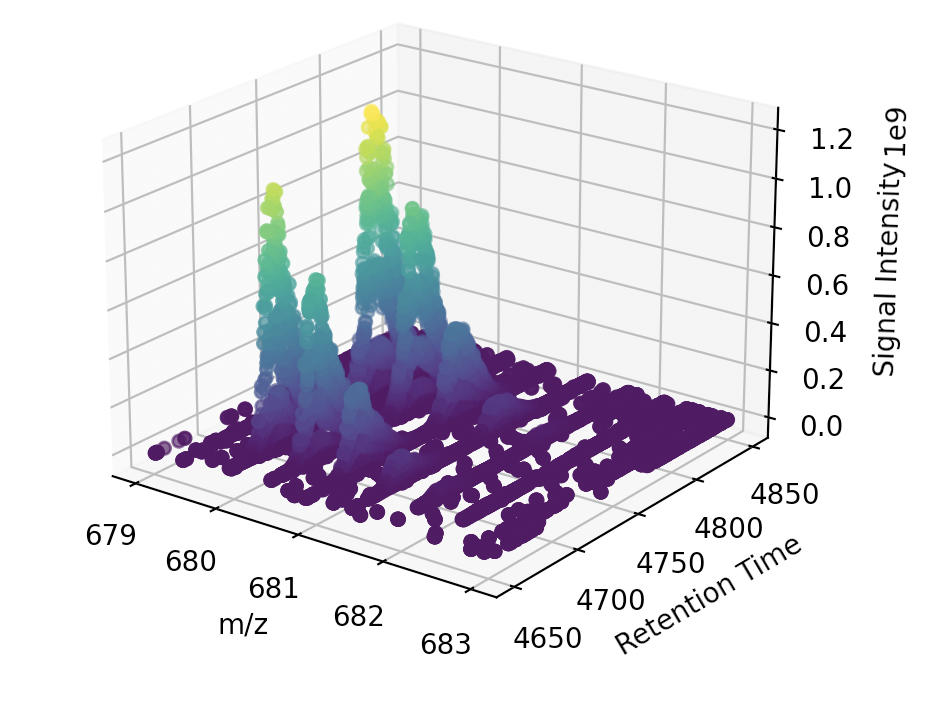

# ms-collect
A series of modules that provide easy storage/accesss to Mass Spec related Raw Data / Groupings of Data.

> Note this package is currently in BETA and is under active development. Moreover, the docs are a work in progress.

## Installation
```sh
pip install ms-collect
```

## Background
In regions of m/z and Retention Time, there exists various signals, features, and collections of data.
This package aims to provide an interface for intuitively representing that data and providing actions/visualizations on said collections.



### **ms-collect**, at its core, provides a base _Collection_ interface to which entities extend from.

For instance, this package has named entities that represent MS Features and Isotopic Traces. But fundamentally they are just a collection of points where each point has 3 primary attributes: mass to charge (m/z), Retention Time, and Intensity/Abundance. 

## Usage
> This section includes very basic usage, refer to the examples section for more details/advanced usage.
Coming soon: Docs via sphynx.

```python
# Import the package and modules of interest
from ms_collect.scope import Scope
from ms_collect.envelope import Envelope
from ms_collection.point import Point

# Define a scope from an m/z and Retention Time region
min_mz = 437.844
max_mz = 438.94
min_rt = 946.004
max_rt = 981.107

my_scope = Scope([min_mz, max_mz, min_rt, max_rt])

# Define an MS-1 Feature/Envelope From said region with a list of Points.
my_points = [...]
my_envelope = Envelope(scope=my_scope, points=my_points)

# Define a point with some m/z, Retention Time, and Intensity values
point = Point(mz=542.3, rt=800.0, intensity=3447661568.0

# Add this point to the envelope and perform some basic envelope collection operations
my_envelope.add_points([point])
my_envelope.avg_mz()
# -> 436.32
my_envelope.cumulative_intensity()
# -> 933484802048.0

# Determine the convex hull of this collection
convexhull = my_envelope.convex_hull()
ch.hull()
# -> [(437.8870316623645, 958.66042827198), (437.88703282730677, 956.1165142560001), (437.8870410510394, 952.112642559), (437.8870495438886, 948.82877457498), (437.887053517079, 948.0991699829999), (437.88705863613876, 947.368067583),(438.22419874976924, 957.5778559199999), (438.2229531181884, 960.11862664002), (437.88945990101047, 962.3162991049801), (437.8882413409473, 961.2199352969999)]

```

### Upcoming features
- Visual utilities for the various types of collections.
- Optimizations on resource intensive class methods.
- Better import/export and IO related functionality.
- Converting a collection to a dataframe.
- Better Api doc experience.
- If you would like to see something here we are accepting feature requests! Please submit an issue or ping us!

## Contribute
Please refer to CONTRIBUTE.md for instructions on on contributing.
